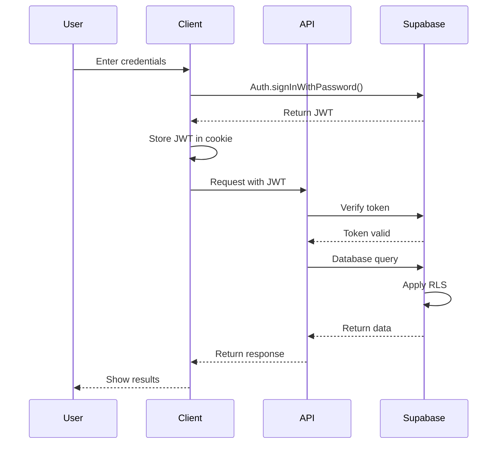

# EventraAI System Architecture

## Overview

EventraAI is built on a modern tech stack using Next.js for the frontend and Supabase for backend services. The architecture follows a serverless approach with API routes handling business logic and database interactions.

## Architecture Components

### Frontend (Next.js)

- **Client Components**: React components rendered in the browser
- **Server Components**: React components rendered on the server
- **API Routes**: Serverless functions handling business logic
- **Middleware**: Request processing for authentication and headers

### Backend (Supabase)

- **Authentication**: Email/password and social auth via Supabase Auth
- **Database**: PostgreSQL database with Row Level Security
- **Storage**: File storage for event attachments and images
- **Edge Functions**: Serverless functions for complex operations

## Database Architecture

### Schema Design

The database follows a relational design with the following key relationships:

- **User-centric**: All data is tied to user accounts
- **Event-based**: Events are the primary entity with related collections
- **Resource allocation**: Tasks, vendors, and guests connect to events


### Row Level Security

Row Level Security (RLS) policies are implemented to ensure secure data access:

```sql
-- Example of RLS on events table
CREATE POLICY events_own_policy ON public.events 
    USING (owner_id = auth.uid() OR 
           EXISTS (SELECT 1 FROM public.event_team WHERE event_id = events.id AND user_id = auth.uid()))
    WITH CHECK (owner_id = auth.uid());
```

### Database Triggers

Triggers maintain data integrity automatically:

```sql
-- Example of updated_at trigger
CREATE TRIGGER update_events_updated_at
    BEFORE UPDATE ON public.events
    FOR EACH ROW
    EXECUTE FUNCTION update_updated_at();
```

## API Architecture

### API Routes Structure

```
/api
├── auth
│   ├── login
│   ├── register
│   └── session
├── events
│   ├── [id]
│   │   ├── tasks
│   │   ├── vendors
│   │   └── guests
│   └── index
├── ai
│   └── generate-checklist
├── tasks
│   └── [id]
└── users
    └── [id]
        └── events
```

### Authentication Flow

1. User logs in via client component form
2. Credentials are sent to Supabase Auth
3. Supabase validates credentials and returns a JWT
4. JWT is stored in cookies for subsequent requests
5. API routes validate JWT via middleware
6. Row Level Security adds database-level protection



### API Middleware

Authentication middleware is applied to protected routes:

```typescript
export function withAuth(
  handler: (req: NextRequest, user: AuthUser) => Promise<NextResponse>
) {
  return async (req: NextRequest) => {
    // Authentication logic
    const { data: { session } } = await supabase.auth.getSession();
    
    if (!session) {
      return NextResponse.json(
        { error: 'Authentication required' },
        { status: 401 }
      );
    }
    
    // Call handler with user context
    return handler(req, user);
  };
}
```

## Role-Based Access Control (RBAC)

The application implements RBAC with the following roles:

- **Admin**: Full system access
- **Owner**: Full access to owned events
- **Editor**: Can edit events but not delete them
- **Viewer**: Read-only access to events
- **User**: Basic system access

Roles are hierarchical, with higher roles inheriting permissions from lower roles.

## Subscription and Limits

Subscription tiers determine usage limits:

| Tier | Events | Guests | AI Usage | Team Members | Storage |
|------|--------|--------|----------|--------------|---------|
| Free | 3      | 50     | 10/month | 0            | 100MB   |
| Starter | 10  | 200    | 50/month | 2            | 1GB     |
| Pro  | Unlimited | 1000 | 200/month | 5          | 5GB     |
| Business | Unlimited | Unlimited | 500/month | 15 | 20GB   |
| Enterprise | Unlimited | Unlimited | Unlimited | Unlimited | 100GB |

Limits are enforced in API routes:

```typescript
// Check if user has reached their event limit
const { count: eventCount } = await supabase
  .from('events')
  .select('id', { count: 'exact' })
  .eq('owner_id', user.id);

const tierLimits = {
  'free': 3,
  'starter': 10,
  'pro': null, // unlimited
  // ...
};
      
const tier = user.subscription_tier || 'free';
const eventLimit = tierLimits[tier];

if (eventLimit !== null && eventCount >= eventLimit) {
  return NextResponse.json(
    { error: 'Event limit reached' },
    { status: 403 }
  );
}
```

## Error Handling and Logging

- API endpoints use consistent error response structure
- Errors include appropriate HTTP status codes
- Client-side error handling with toast notifications
- Debug logging in development environment
- Error tracking for production issues

## Performance Considerations

- API response caching
- Database indexes on frequently queried columns
- Pagination for large result sets
- Optimistic UI updates
- Lazy loading for components and routes

## Security Measures

- HTTPS for all communication
- JWT with short expiration times
- CORS protection
- Sanitized user input
- SQL injection protection via parameterized queries
- Content Security Policy headers
- Rate limiting on authentication endpoints

## Integration Points

- **Stripe**: Payment processing for subscriptions
- **SendGrid**: Email notifications
- **OpenAI**: AI task suggestions
- **Social Auth Providers**: OAuth integration 